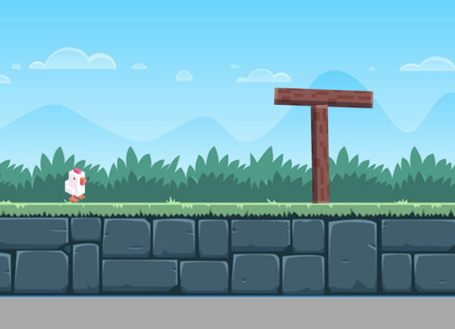

# Chicken on a raft

# install
- Klik "use this template" als je de oefening in je eigen github wil hebben
- clone de repo
- typ `npm install` en dan `npm run dev`

  

# Opdracht

## Boomstammen
- plaats boomstammen in de game met `this.add()`
- plaats de stammen op een random y positie

## Kippen
- plaats kippen op de boomstammen met `this.addChild()`
- geef de kip een correcte y positie zodat het lijkt alsof de kip op de boom staat
- geef de kip een random x positie, maar wel binnen de afmetingen van de boom *(x positie van -200 tot 200)*.

## Hoedje
- geef de kip een hoedje, doe dit ook weer met `addChild()`

## Expert
- kan je de kip heen en weer laten bewegen op de boomstam in `onPostUpdate()`?
- kan je de afbeelding van het hoedje random maken? (hat of cap)
- er zijn drie "toktok" geluidjes, kan je een random geluidje kiezen?
- geef de kip een gun die kan schieten 🤯

## Werken met Random
- De code `Math.random()` geeft een getal tussen 0 en 1
- `Math.random() * 400` is dus een getal tussen 0 en 400
- `Math.random() * 400 - 200` is dan een getal tussen -200 en 200
- Vraag aan copilot hoe je een random plaatje kan kiezen, of een random geluidje

## Links
- [Deze opdracht is tot stand gekomen dankzij deze video](https://www.youtube.com/watch?v=yVihOxP2QeY)